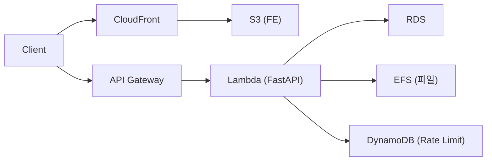
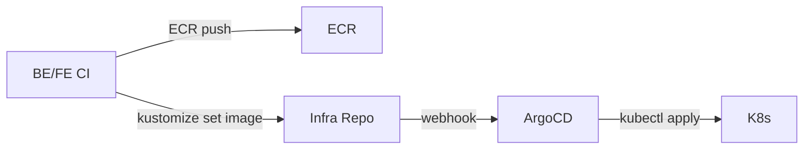
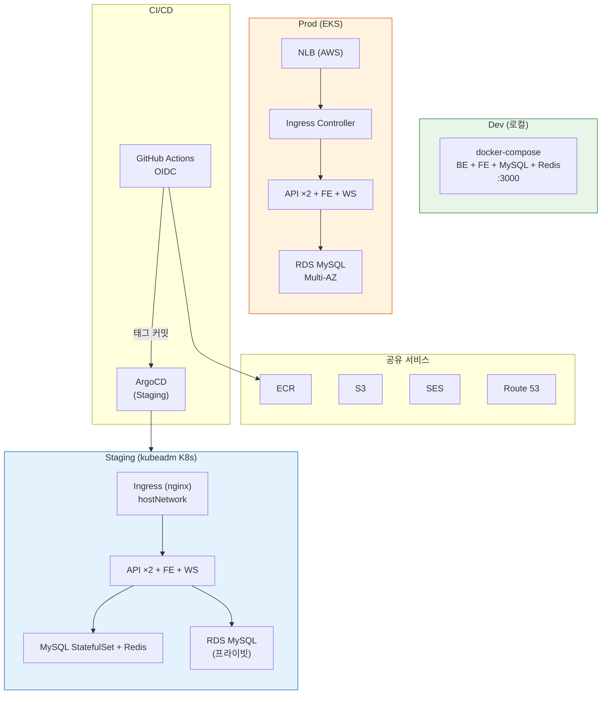
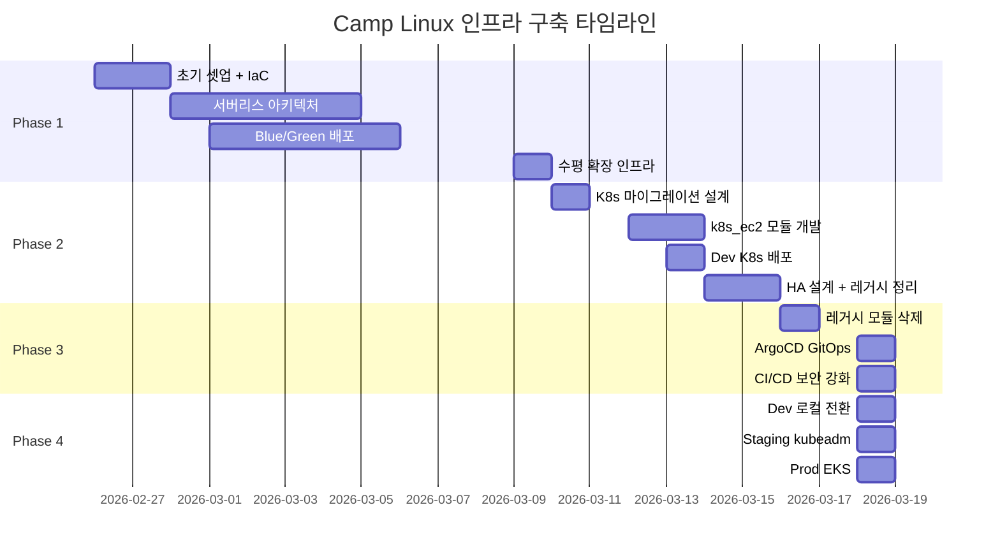

# Camp Linux 인프라 구축 여정

> **기간**: 2026-02-26 ~ 2026-03-18 (21일)
> **커밋**: 132개
> **진화**: 서버리스 → kubeadm K8s → 3환경 분리 (로컬 / kubeadm / EKS)

---

## 목차

1. [Phase 1: 서버리스 기반 구축 (2/26 ~ 3/9)](#phase-1-서버리스-기반-구축)
2. [Phase 2: K8s 마이그레이션 (3/10 ~ 3/15)](#phase-2-k8s-마이그레이션)
3. [Phase 3: GitOps + 레거시 정리 (3/16 ~ 3/18 오전)](#phase-3-gitops--레거시-정리)
4. [Phase 4: 환경 재구성 (3/18)](#phase-4-환경-재구성)
5. [최종 아키텍처](#최종-아키텍처)
6. [배운 것들](#배운-것들)

---

## Phase 1: 서버리스 기반 구축

**기간**: 2026-02-26 ~ 2026-03-09 (12일)

### 1.1 초기 셋업 (2/26)

인프라 코드를 별도 저장소로 분리하고 Terraform 기반 IaC를 구축했습니다.

```
init: 인프라 코드 개별 저장소로 분리
feat: Terraform state를 S3 + DynamoDB로 저장
feat: 인프라 코드 CI/CD 자동화
```

- S3 + DynamoDB 원격 상태 백엔드
- GitHub Actions OIDC 인증 (장기 자격 증명 제거)
- 환경별 디렉토리 분리 (`environments/{bootstrap,dev,staging,prod}`)

### 1.2 서버리스 아키텍처 (2/28 ~ 3/9)



**구축한 모듈 (12개)**:

| 순서 | 모듈 | 역할 |
|------|------|------|
| 1 | iam | IAM 사용자/그룹/OIDC |
| 2 | vpc | VPC, 서브넷, NAT Gateway |
| 3 | s3 | 프론트엔드 호스팅, CloudTrail |
| 4 | route53 + acm | DNS + SSL |
| 5 | ses | 이메일 발송 |
| 6 | ecr | Docker 이미지 저장 |
| 7 | rds | MySQL 관리형 DB |
| 8 | ec2 | Bastion Host |
| 9 | cloudtrail | 감사 로그 |
| 10 | lambda | FastAPI 컨테이너 |
| 11 | api_gateway | HTTP API + WebSocket |
| 12 | cloudfront | CDN + 정적 배포 |

**추가 모듈**: efs (파일 스토리지), dynamodb (Rate Limiter, WebSocket 세션), eventbridge (배치 작업), cloudwatch (모니터링)

### 1.3 Blue/Green 배포 (3/1 ~ 3/5)

```
feat: add Lambda alias 'live' for Blue/Green deployment
feat: wire Lambda alias to API Gateway in all environments
feat: add Blue/Green IAM permissions to GitHub Actions OIDC role
```

Lambda Alias를 활용한 무중단 배포:
- 새 버전 발행 → Health Check → Alias `live` 전환
- 실패 시 이전 버전으로 즉시 롤백
- `terraform ignore_changes`로 CD가 관리하는 필드 보호

### 1.4 수평 확장 인프라 (3/9)

```
feat: 수평 확장 인프라 — 분산 Rate Limiter + EventBridge 배치 작업
```

- DynamoDB Fixed Window Counter Rate Limiter
- EventBridge → Lambda 스케줄 (토큰 정리, 피드 재계산)
- WebSocket API Gateway + Lambda + DynamoDB 연결 관리

### 1.5 서버리스의 한계

| 문제 | 영향 |
|------|------|
| **콜드 스타트 3~10초** | VPC ENI + SSM + 앱 초기화 |
| **Lambda별 커넥션 풀** | DB 커넥션 폭발 위험 |
| **EFS 마운트 지연** | 파일 업로드 첫 요청 느림 |
| **DynamoDB 비용** | Rate Limiter + WebSocket 세션 이중 과금 |
| **디버깅 어려움** | CloudWatch 로그만으로 추적 |

---

## Phase 2: K8s 마이그레이션

**기간**: 2026-03-10 ~ 2026-03-15 (6일)

### 2.1 설계 (3/10)

`docs/plans/2026-03-10-k8s-migration-design.md`에 마이그레이션 설계 문서 작성.

핵심 결정:
- **kubeadm on EC2** 선택 (EKS 대비 학습 효과, 비용 절감)
- **hostNetwork Ingress** (외부 LB 없이 직접 트래픽 수신)
- **Calico CNI** (NetworkPolicy 지원)
- **S3 직접 업로드** (EFS 마운트 대체)

### 2.2 k8s_ec2 모듈 개발 (3/12 ~ 3/13)

```
feat: k8s 배포
fix: 코드 리뷰 Critical 이슈 수정 (SG, chmod, PVC)
```

새로운 Terraform 모듈 `modules/k8s_ec2`:
- EC2 인스턴스 (Master + Worker) + EIP
- user_data로 kubeadm, containerd, Calico 자동 설치
- K8s Internal SG (자기 참조 — Calico 직접 라우팅)
- ACPI Power Button 방어 (`HandlePowerKey=ignore`)
- S3 업로드 IAM 역할

K8s 매니페스트 (`k8s/` 디렉토리):
- Kustomize base/overlay 패턴
- 환경별 오버레이 (`overlays/{dev,staging,prod}`)
- 4개 CronJob (토큰 정리, 피드 재계산, MySQL 백업, ECR 토큰 갱신)
- HPA (CPU 70%, min 2 → max 4)

### 2.3 Dev 환경 배포 (3/13)

```
Dev 클러스터: 1 Master + 2 Worker (c7i-flex.large)
VPC: 10.0.0.0/16
```

kubeadm init → Worker join → cert-manager + ingress-nginx + Prometheus + Redis 설치 → 앱 배포.

### 2.4 HA 설계 완료 (3/14)

```
feat: k8s_ec2 모듈에 HA 지원 (3 Master + HAProxy)
```

Staging/Prod용 HA 아키텍처 코드 작성 (배포는 Free Tier EIP 한도로 보류):
- `master_count` / `haproxy_enabled` 변수로 환경별 전환
- HAProxy L4 LB → K8s API 서버 3대 로드밸런싱

### 2.5 레거시 정리 (3/15 ~ 3/16)

```
chore: move 9 Lambda-era modules to modules/_legacy/
chore: Lambda 시대 레거시 Terraform 모듈 9개 삭제
```

서버리스 시대의 9개 모듈을 완전 삭제:
efs, lambda, api_gateway, cloudwatch, cloudfront, dynamodb, api_gateway_websocket, lambda_websocket, eventbridge

---

## Phase 3: GitOps + 레거시 정리

**기간**: 2026-03-16 ~ 2026-03-18 오전 (2.5일)

### 3.1 ArgoCD 도입 (3/18 오전)

```
feat: ArgoCD 추가
fix: ArgoCD 소스 저장소를 fork로 변경
```

SSH 기반 배포 → **GitOps** 전환:



- **App-of-Apps 패턴**: root-app → 환경별 Application CRD
- **Dev**: 자동 sync, **Staging/Prod**: 수동 sync
- **GitHub OAuth SSO** (Dex 내장 커넥터)
- SSH 접근 + SG 동적 조작 제거

### 3.2 CI/CD 보안 강화 (3/18)

19개 보안 이슈 발견 → 13개 코드 수정:

| 심각도 | 수정 | 내용 |
|--------|------|------|
| Critical | C-2 | ArgoCD webhook HMAC 시크릿 |
| High | H-1 | 서드파티 Action SHA 고정 |
| High | H-2 | S3 배포 빌드 검증 |
| High | H-3 | IAM OIDC 권한 리소스 스코핑 |
| High | H-4 | ECR `:latest` 태그 제거 |
| High | H-5 | CI SECRET_KEY 동적 생성 |
| Medium | M-1~5 | concurrency, permissions, RBAC 등 |
| Low | L-1~2 | MySQL 비밀번호 보호, pip→uv 전환 |

---

## Phase 4: 환경 재구성

**기간**: 2026-03-18 (1일)

### 4.1 설계 결정

| 환경 | 이전 | 이후 | 이유 |
|------|------|------|------|
| **Dev** | kubeadm K8s (EC2 3대) | docker-compose (로컬) | 비용 $150/월 → $0, 빠른 반복 |
| **Staging** | 미배포 | kubeadm K8s (EC2 3대) | 프로덕션 전 검증 환경 |
| **Prod** | 미배포 | **EKS** (Managed Node Group) | 관리형 컨트롤 플레인, 자동 업그레이드 |

### 4.2 Dev 로컬 환경 (docker-compose)

`docker-compose.local.yml` 구성:

| 서비스 | 이미지 | 포트 |
|--------|--------|------|
| frontend | nginx + Vite 빌드 | 3000 |
| backend | FastAPI + Uvicorn | 8000 (내부) |
| database | MySQL 9.6 | 3306 |
| redis | Redis 7 Alpine | 6379 |

- `nginx.local.conf`: K8s conf 기반 + API/WS 프록시
- `config.js`: Vite dev / docker-compose / K8s 3모드 자동 감지

### 4.3 Dev K8s → Staging 전환

1. `terraform destroy` (Dev K8s 삭제)
   - IAM 모듈 삭제로 `admin-dev` 권한 소실 → 루트 계정으로 복구
   - S3/ECR `force_delete` 필요 → 수동 정리
2. Staging Terraform 수정: 3M+2W+HAProxy(HA) → **1M+2W** (축소)
3. `terraform apply` (Staging 신규 생성)
4. K8s 부트스트랩: kubeadm init → Worker join → Helm 컴포넌트 → 앱 배포 → ArgoCD

### 4.4 Prod EKS 구축

1. `modules/eks` Terraform 모듈 신규 개발
   - EKS Cluster + Managed Node Group
   - OIDC Provider (IRSA 지원)
   - Node IAM Role (ECR pull, S3 upload)
2. `environments/prod/main.tf`: `k8s_ec2` → `eks` 모듈로 교체
3. `terraform apply` (87개 리소스 생성, ~15분)
   - SES DKIM 레코드 충돌 → `terraform import`로 해결
4. EKS 부트스트랩: metrics-server + cert-manager + ingress-nginx(NLB)
5. ECR push → 앱 배포 → DB 스키마 초기화
6. Route53 A레코드 → NLB Alias

**kubeadm vs EKS 차이**:

| 항목 | kubeadm (Staging) | EKS (Prod) |
|------|-------------------|------------|
| 컨트롤 플레인 | 자체 관리 (EC2) | **AWS 관리형** |
| kubectl 실행 | SSH → Master | **로컬에서 직접** |
| CNI | Calico | **VPC CNI** (네이티브) |
| Ingress | hostNetwork DaemonSet | **NLB + Service** |
| 노드 | 퍼블릭 서브넷 | **프라이빗 서브넷** |
| 비용 | EC2만 | EKS $73/월 + EC2 |

---

## 최종 아키텍처



### 환경별 URL

| 환경 | URL | 인프라 | 월 비용 |
|------|-----|--------|---------|
| Dev | http://127.0.0.1:3000 | docker-compose | $0 |
| Staging | https://staging.my-community.shop | kubeadm 1M+2W | ~$150 |
| Prod | https://my-community.shop | EKS t3.medium ×2 | ~$250 |

### Terraform 모듈 현황

| # | 모듈 | 용도 | 상태 |
|---|------|------|------|
| 0 | iam | IAM 사용자/그룹/OIDC | 활성 |
| 1 | vpc | VPC, 서브넷, NAT | 활성 |
| 2 | s3 | 업로드, CloudTrail | 활성 |
| 3 | route53 | DNS | 활성 |
| 4 | acm | SSL 인증서 | 활성 |
| 5 | ses | 이메일 발송 | 활성 |
| 6 | ecr | 컨테이너 이미지 | 활성 |
| 7 | rds | MySQL 관리형 DB | 활성 |
| 8 | ec2 | Bastion Host | 활성 |
| 9 | cloudtrail | 감사 로그 | 활성 |
| 10 | k8s_ec2 | kubeadm K8s (Staging) | 활성 |
| 11 | tfstate | S3 + DynamoDB 백엔드 | 활성 |
| **12** | **eks** | **EKS 클러스터 (Prod)** | **신규** |

---

## 배운 것들

### 인프라 설계

1. **환경 분리는 처음부터**: dev/staging/prod 디렉토리를 초기에 만들어두면 나중에 전환이 수월합니다. 다만 `main.tf`를 맹목적으로 복사하면 state 충돌 위험이 있습니다.

2. **서버리스 → 컨테이너 전환 근거**: 콜드 스타트와 DB 커넥션 관리 문제가 결정적이었습니다. Lambda의 자동 스케일링은 강력하지만, VPC 내부 워크로드에서는 트레이드오프가 큽니다.

3. **kubeadm vs EKS는 단계적으로**: kubeadm으로 K8s 내부를 학습한 후 EKS로 전환하면, 관리형 서비스가 대신 해주는 것과 직접 해야 하는 것의 경계를 명확히 이해할 수 있습니다.

### 운영

4. **terraform destroy의 의존성**: IAM 모듈을 포함한 destroy는 실행 중인 사용자의 권한을 제거할 수 있습니다. destroy 순서에 주의가 필요합니다.

5. **SES DNS 레코드 공유**: SES DKIM/Verification 레코드는 도메인 단위로 공유됩니다. 여러 환경에서 같은 도메인을 사용하면 `terraform import`가 필요합니다.

6. **EKS Security Group**: EKS가 자동 생성하는 Cluster Security Group과 Terraform이 생성하는 SG는 다릅니다. RDS 접근 규칙은 EKS Cluster SG를 사용해야 합니다.

### 보안

7. **CI/CD 보안은 초기부터**: `permissions: {}`, Action SHA 고정, OIDC 리소스 스코핑은 프로젝트 초기에 적용하는 것이 좋습니다. 나중에 수정하면 모든 워크플로우를 검토해야 합니다.

8. **ArgoCD webhook 시크릿**: GitOps 도입 시 webhook HMAC 인증은 필수입니다. 없으면 누구나 sync를 트리거할 수 있습니다.

### 비용

9. **환경별 비용 최적화**: Dev를 로컬로 전환하면 월 $150을 절약할 수 있습니다. Staging은 Non-HA(1M+2W)로 축소하여 비용을 절반으로 줄였습니다.

10. **EKS 고정 비용**: EKS 컨트롤 플레인 $73/월은 고정입니다. 소규모 프로젝트에서는 kubeadm이 비용 효율적이지만, 운영 부담과 트레이드오프입니다.

---

## 타임라인 요약


